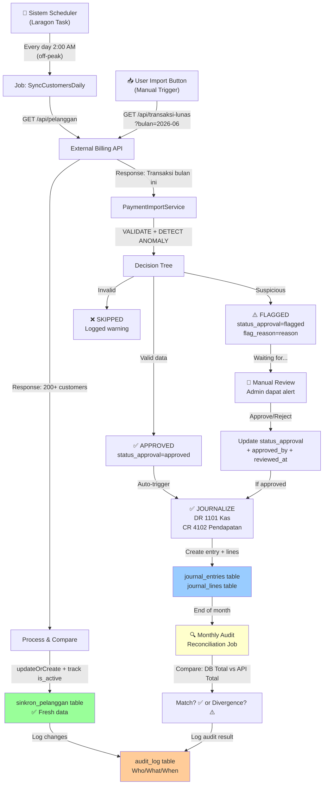
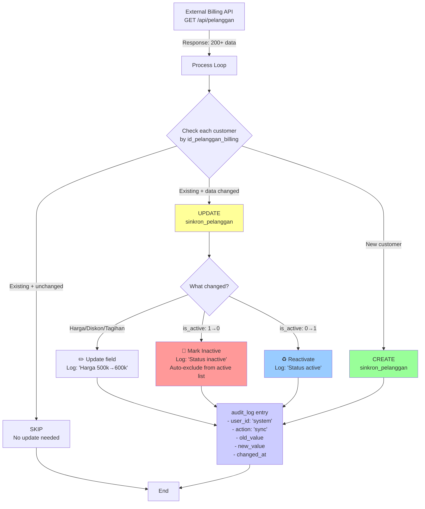
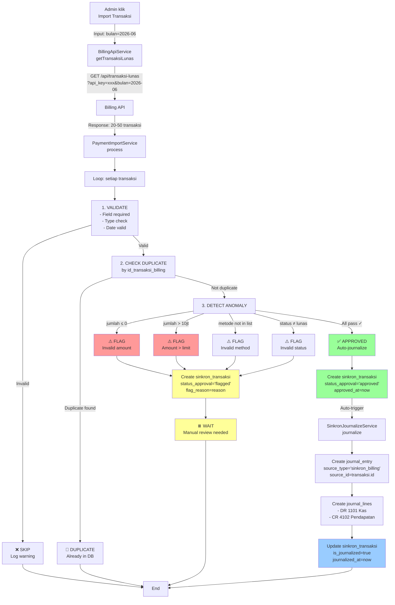
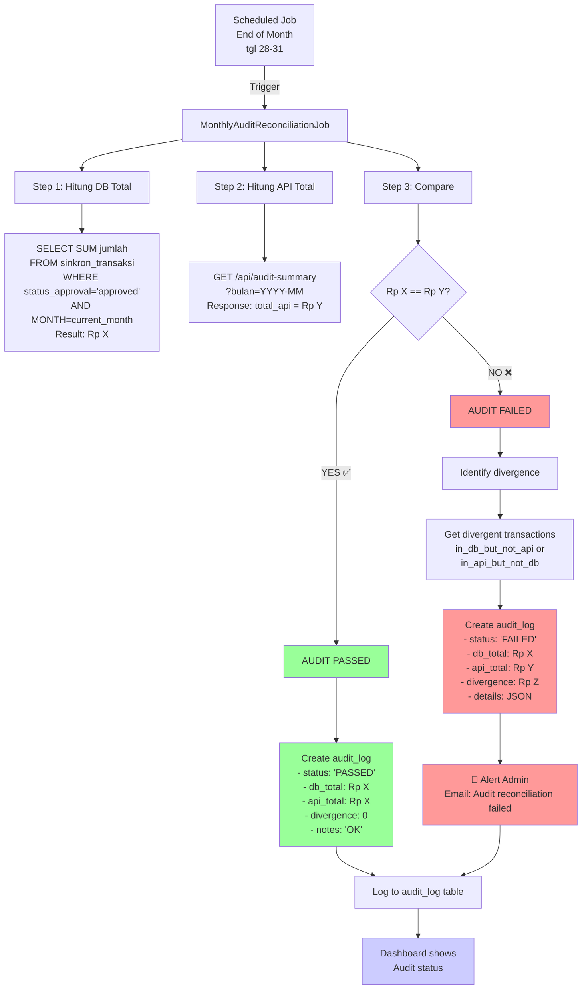
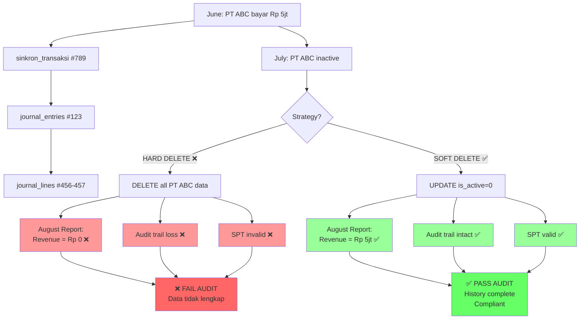
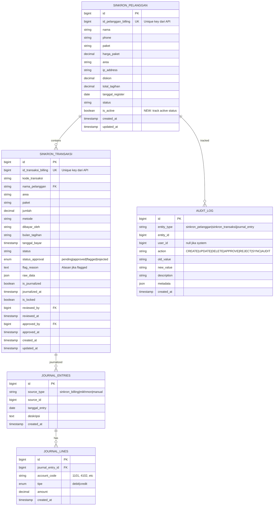
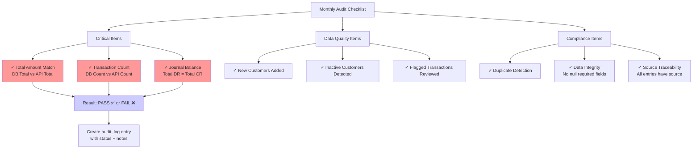

# 📊 Diagram - Workflow Auto-Sync & Journalize

## 1️⃣ WORKFLOW REKOMENDASI UTAMA

---

## 2️⃣ PELANGGAN SYNC PROCESS DETAIL

---

## 3️⃣ TRANSAKSI IMPORT & JOURNALIZE FLOW

---

## 4️⃣ MONTHLY AUDIT RECONCILIATION

---

## 5️⃣ SOFT DELETE vs HARD DELETE COMPARISON

---

## 6️⃣ DATABASE SCHEMA YANG DIPERLUKAN

---

## 7️⃣ MONTHLY AUDIT CHECKLIST

---

## 📝 QUICK REFERENCE

### Architecture Decision
- **Daily Sync:** 2:00 AM (off-peak)
- **Manual Import:** On-demand button
- **Auto-Journalize:** For approved transactions
- **Manual Review:** For flagged transactions
- **Monthly Audit:** End of month reconciliation
- **History Policy:** Soft-delete (is_active=0), keep all history

### Volume
- Customers: 227 aktif
- Transactions: ~20-50/hari
- Billing cycle: Tgl 11 setiap bulan

### Key Tables
- `sinkron_pelanggan` + NEW: `is_active` column
- `sinkron_transaksi` (already has status_approval)
- NEW: `audit_log` (for compliance tracking)
- `journal_entries` (auto-created from approved transaksi)

### Key Services
- `BillingApiService` (HTTP calls to API)
- `PaymentImportService` (validate + process transaksi)
- `SinkronJournalizeService` (create journal entries)
- NEW: `DailySyncCustomersJob` (scheduled sync)
- NEW: `MonthlyAuditReconciliationJob` (audit)
